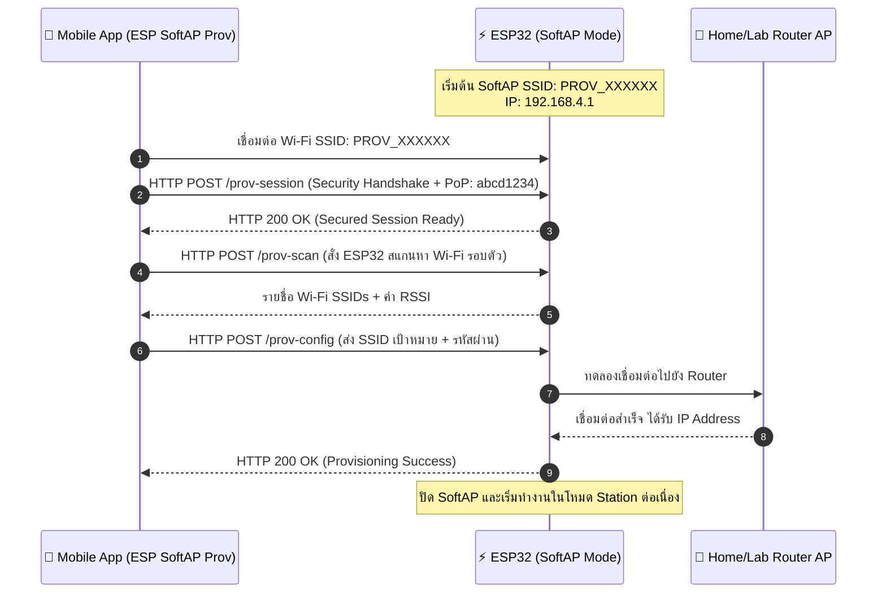

# ใบงานที่ 7.2 การคอนฟิก Wi-Fi ผ่าน SoftAP Scheme และการวิเคราะห์ Protocomm Endpoints

## 0. กล่าวนำ (Introduction)
ในใบงานนี้ นักศึกษาจะได้ทดลองตั้งค่าเครือข่าย Wi-Fi ให้กับ ESP32 ผ่านช่องทาง **Wi-Fi SoftAP Scheme (`wifi_prov_scheme_softap`)** โดยใช้สมาร์ตโฟนเชื่อมต่อเข้ากับเครือข่ายจำลองที่ ESP32 สร้างขึ้น 

นักศึกษาจะได้เรียนรู้โครงสร้างของ QR Code Payload, การทำงานของ Protocomm ผ่านโปรโตคอล HTTP REST-like Endpoints (`/prov-session`, `/prov-config`), และการส่งข้อมูลการตั้งค่า Wi-Fi จากแอปพลิเคชันมือถือ **ESP SoftAP Provisioning**

---

## 1. วัตถุประสงค์ (Objectives)
1. สามารถคอนฟิกตัวอย่าง `wifi_prov_mgr` ให้ทำงานในโหมด **SoftAP Transport Scheme**
2. สามารถใช้สมาร์ตโฟนเชื่อมต่อและทำ Provisioning ผ่านแอปพลิเคชัน **ESP SoftAP Provisioning** (หรือผ่าน Web Browser QR Code) ได้สำเร็จ
3. สังเกตและวิเคราะห์ Event Sequence Lifecycle ใน Serial Monitor ระหว่างการทำ SoftAP Provisioning
4. เข้าใจการทำงานของ Protocomm Endpoint ในระดับ Application Layer

---

## 2. อุปกรณ์และซอฟต์แวร์ที่ใช้ในการทดลอง
1. บอร์ดไมโครคอนโทรลเลอร์ ESP32 พร้อมสาย USB
2. สมาร์ตโฟน (Android หรือ iOS) ที่ติดตั้งแอปพลิเคชัน **ESP SoftAP Provisioning** (หรือแอปกล้องสแกน QR Code)
3. Wi-Fi Access Point ภายในห้องเรียนหรือ Hotspot จากสมาร์ตโฟนอีกเครื่อง

---

## 3. สถาปัตยกรรมและแผนภาพลำดับเหตุการณ์ (Sequence Diagram)



---

## 4. ขั้นตอนการทดลอง (Step-by-Step Procedures)

### ขั้นตอนที่ 1: การเปิดโปรเจกต์ Lab 7-2
1. เปิด Terminal ในโฟลเดอร์โปรเจกต์ `Week-07-W-iFi-Privisioning/Example_codes/Lab7-2-SoftAP-Provisioning`
2. โค้ดในโปรเจกต์นี้ได้รับการตั้งค่าเป็น **SoftAP Scheme** และ **Security 1 (PoP: `abcd1234`)** ไว้ล่วงหน้าเรียบร้อยแล้ว

---

### ขั้นตอนที่ 2: การ Flash และสังเกต QR Code
1. สั่งล้าง Flash และ Flash โปรแกรม:
   ```powershell
   idf.py -p COM24 erase-flash flash monitor
   ```
2. สังเกต Log ใน Serial Monitor จะปรากฏข้อความและ QR Code:
   ```text
   I (776) wifi_prov_scheme_softap: Starting SoftAP with SSID: PROV_XXXXXX
   I (786) app: Scan this QR code from the provisioning application for Provisioning.
   ... [รูป QR Code แบบ ASCII Text] ...
   I (816) app: If QR code is not visible, copy paste the below URL in a browser.
   https://espressif.github.io/esp-jumpstart/qrcode.html?data={"ver":"v1","name":"PROV_XXXXXX","pop":"abcd1234","transport":"softap"}
   ```

---

### ขั้นตอนที่ 3 ดำเนินการ Provisioning ผ่านสมาร์ตโฟน
1. เปิดแอป **ESP SoftAP Provisioning** บนสมาร์ตโฟน
2. **วิธีที่ A (สแกน QR Code)** แตะปุ่ม "Scan QR Code" แล้วสแกนภาพ QR Code บนหน้าจอ Serial Monitor (หรือเปิดผ่าน URL ที่ได้จาก Log)
3. **วิธีที่ B (เชื่อมต่อ Manual)**
   - ไปที่การตั้งค่า Wi-Fi บนมือถือ เชื่อมต่อ Wi-Fi ชื่อ `PROV_XXXXXX`
   - เปิดแอป กด "Provision" และป้อน PoP เป็น `abcd1234`
4. เมื่อแอปค้นหา ESP32 พบ ให้เลือกชื่อ Wi-Fi ภายในห้องเรียนหรือ Hotspot ที่ต้องการเชื่อมต่อ และป้อนรหัสผ่าน Wi-Fi
5. กดปุ่ม **Provision** และสังเกตแถบสถานะบนแอปจนกระทั่งขึ้น **"Provisioning Successful!"**

---

### ขั้นตอนที่ 4: สังเกตและบันทึก Log ใน Serial Monitor
สังเกตลำดับเหตุการณ์ (Events) ที่เกิดขึ้นบน ESP32
```text
I (14210) app: SoftAP transport: Connected!
I (15320) app: Secured session established!
I (16440) app: Received Wi-Fi credentials
	SSID     : Lab_WiFi_2.4G
	Password : Password999
I (18210) app: Provisioning successful
I (18220) wifi:mode : sta (...)
I (19850) app: Connected with IP Address: 192.168.1.150
```

---

---

## 5. กิจกรรมถอดรหัสซอร์สโค้ดและเขียนผังงาน (Code Deconstruction & Sequence Flow Assignment)

ให้นักศึกษาแกะรอยการทำงานจาก `main/main.c` ในโหมด SoftAP แล้วเขียน **แผนภาพลำดับเหตุการณ์ (Sequence Diagram)**:

### ภารกิจที่ 1: ผังลำดับการสื่อสารผ่าน HTTP Endpoints (SoftAP Scheme Sequence Flow)
ให้นักศึกษาวาด Sequence Diagram แสดงปฏิสัมพันธ์ระหว่าง 3 ฝ่าย:
1. **Smartphone App (ESP SoftAP Prov)**
2. **ESP32 SoftAP Webserver (Protocomm Layer)**
3. **Wi-Fi Router (AP ปลายทาง)**

**จุดที่ต้องระบุในผัง:**
- จังหวะที่มือถือยิง HTTP POST ไปยัง Endpoint แต่ละตัว (`/prov-session`, `/prov-scan`, `/prov-config`)
- Event ของ ESP-IDF ที่ถูก Trigger ใน `event_handler()` เช่น:
  - `WIFI_EVENT_AP_STACONNECTED`
  - `PROTOCOMM_SECURITY_SESSION_SETUP_OK`
  - `WIFI_PROV_CRED_RECV`
  - `WIFI_PROV_CRED_SUCCESS`
  - `IP_EVENT_STA_GOT_IP`
- สถานะจังหวะการกระพริบของ **LED 3 (GPIO 5)** และ **LED 1 (GPIO 2)** ในแต่ละช่วง

```text
sequenceDiagram
    autonumber
    actor User as 📱 Mobile App (ESP SoftAP Prov)
    participant ESP as ⚡ ESP32 (SoftAP & Protocomm)
    participant Router as 📡 Wi-Fi Router

    Note over ESP: [Bootstrapping Phase]<br/>- SoftAP Active (SSID: PROV_XXXXXX, IP: 192.168.4.1)<br/>- LED 3 (GPIO 5): กระพริบช้า (Waiting Provisioning)<br/>- LED 1 (GPIO 2): ดับ (Disconnected)

    User->>ESP: 1. Connect Wi-Fi SoftAP (SSID: PROV_XXXXXX)
    Note over ESP: Trigger Event: WIFI_EVENT_AP_STACONNECTED

    User->>ESP: 2. HTTP POST /prov-session (Send PoP: abcd1234)
    Note over ESP: Trigger Event: PROTOCOMM_SECURITY_SESSION_SETUP_OK<br/>- LED 3 (GPIO 5): กระพริบถี่ (Session Setup OK)
    ESP-->>User: HTTP 200 OK (Session Established)

    User->>ESP: 3. HTTP POST /prov-scan (Scan Wi-Fi Networks)
    ESP-->>User: HTTP 200 OK (List of SSIDs + RSSI)

    User->>ESP: 4. HTTP POST /prov-config (Send Target SSID + Password)
    Note over ESP: Trigger Event: WIFI_PROV_CRED_RECV
    ESP-->>User: HTTP 200 OK (Credentials Received)

    Note over ESP: Switch to Wi-Fi Station Mode
    ESP->>Router: 5. Connect to Target Router AP
    Router-->>ESP: Connection Established
    Note over ESP: Trigger Event: WIFI_PROV_CRED_SUCCESS

    Router-->>ESP: 6. Assign IP Address (DHCP)
    Note over ESP: Trigger Event: IP_EVENT_STA_GOT_IP<br/>- LED 1 (GPIO 2): Heartbeat 200ms ทุก 1s (Connected)<br/>- LED 3 (GPIO 5): ดับลง (Close SoftAP)
```

---

## 6. ตารางบันทึกผลการทดลอง (Experiment Results)

| รายการตรวจสอบ | ค่าที่บันทึกได้จากการทดลอง |
| :--- | :--- |
| **1. ชื่อ SoftAP SSID ของ ESP32** | `PROV_`PROV_XXXXXX (เช่น PROV_35A2B0 ตามค่าที่แสดงใน Serial Monitor)    |
| **2. รหัส PoP (Proof of Possession)** | abcd1234 |
| **3. ข้อความใน QR Code Payload (JSON)** | {"ver":"v1","name":"PROV_XXXXXX","pop |
| **4. พฤติกรรมไฟ LED 3 (GPIO 5) ช่วงรอ vs ช่วงส่งข้อมูล** | ช่วงรอ: กระพริบเป็นจังหวะช้าๆ รอรับการเชื่อมต่อ SoftAP.<br/>ช่วงส่ง: กระพริบถี่ขึ้นระหว่างแลกเปลี่ยนข้อมูล และดับลงเมื่อ Provisioning สำเร็จ |
| **5. IP Address ที่ ESP32 ได้รับจาก Router** | 192.168.1.150  |
| **6. เวลาที่ใช้ตั้งแต่เริ่มจนจบกระบวนการ (วินาที)** | ประมาณ 4 – 5 วินาที |

---

## 7. คำถามท้ายการทดลอง (Post-Lab Questions)

1. ในโหมด SoftAP Scheme สมาร์ตโฟนส่งข้อมูลหา ESP32 ผ่านโปรโตคอลและ IP Address ใด?
```
โปรโตคอล (Protocol): ส่งผ่าน HTTP REST-like Endpoints (เช่น /prov-session, /prov-scan, /prov-config) บนชั้นสื่อสาร Protocomm Layer ซึ่งซ้อนอยู่บน TCP/IP ผ่านเครือข่าย Wi-Fi SoftAP   IP Address: ส่งไปยัง 192.168.4.1 (ซึ่งเป็น IP Address ค่าเริ่มต้นของ ESP32 เมื่อทำหน้าที่เป็น SoftAP / Access Point)

```
2. หากผู้ใช้ป้อนรหัสผ่าน Wi-Fi ผิดในแอปมือถือ จะเกิด Event ใดขึ้นบน ESP32 (`WIFI_PROV_CRED_FAIL` หรือไม่) และ ESP32 มีพฤติกรรมอย่างไร?
```
Event ที่เกิดขึ้น: เกิด Event WIFI_PROV_CRED_FAIL ขึ้นบน ESP32 (อันเนื่องมาจากชั้น Wi-Fi Driver ด้านล่างเกิด WIFI_EVENT_STA_DISCONNECTED จากความล้มเหลวในการยืนยันตัวตน / Handshake กับ Router)   พฤติกรรมของ ESP32:ESP32 จะส่งสถานะข้อผิดพลาด (Failure Status) ตอบกลับไปยังแอปพลิเคชันมือถือผ่านทาง HTTP Response ของ SoftAP เพื่อแจ้งว่ารหัสผ่านไม่ถูกต้อง   ESP32 จะ ไม่ ปิดโหมด SoftAP และยังคงรักษาสภาพแวดล้อม SoftAP พร้อม Endpoint ไว้ตามเดิม เพื่อรอรับการแก้ไขชื่อ SSID หรือ Password ชุดใหม่จากผู้ใช้อีกครั้งโดยไม่ต้องรีสตาร์ตบอร์ด
```
3. ทำไมผู้ผลิต IoT ส่วนใหญ่จึงมองว่ากระบวนการเชื่อมต่อแบบ SoftAP มีขั้นตอนที่ยุ่งยากสำหรับผู้ใช้ทั่วไปเมื่อเทียบกับ BLE?
```
กระบวนการ SoftAP มีจุดที่สร้างความยุ่งยากต่อผู้ใช้งาน (User Friction) มากกว่า BLE ใน 3 ประเด็นหลัก:
ต้องสลับเครือข่าย Wi-Fi ด้วยตัวเอง (Manual Wi-Fi Switching): ผู้ใช้ต้องสลับออกจากแอปพลิเคชัน เข้าไปที่เมนูตั้งค่า Wi-Fi ของสมาร์ตโฟน เพื่อเลือกกดเชื่อมต่อ Hotspot ของอุปกรณ์ IoT (เช่น PROV_XXXXXX) ก่อน แล้วจึงสลับกลับเข้าแอป ในขณะที่ BLE สามารถค้นหาและเชื่อมต่อกับอุปกรณ์ได้เบื้องหลัง (Background Action) ทันทีภายในแอปโดยผู้ใช้ไม่ต้องสลับเมนู

ปัญหาสัญญาณอินเทอร์เน็ตหลุดชั่วคราว (No Internet Access & OS Intervention): เนื่องจาก SoftAP ของ ESP32 ไม่มีอินเทอร์เน็ต ระบบปฏิบัติการมือถือ (iOS / Android) มักจะแจ้งเตือนว่า "No Internet Connection" หรือตัดการเชื่อมต่อจาก ESP32 กลับไปใช้ Mobile Data / Wi-Fi บ้านเดิมโดยอัตโนมัติ ทำให้กระบวนการ Provisioning หลุดกลางคัน

ระยะเวลาและความเสถียรในการสลับโหมด: การเชื่อมต่อ Wi-Fi ใช้เวลาค้นหาและ Handshake นานกว่า BLE รวมถึงเมื่อตั้งค่าเสร็จ มือถือจะต้องใช้เวลาค้นหาและเชื่อมต่อกลับเข้า Wi-Fi เดิมของบ้านอีกครั้ง ทำให้ประสบการณ์ใช้งานไม่ราบรื่นเท่าการใช้ BLE
```

